## Hi 👋 I'm Dom (Domenico)

I'm an assistant professor (RTD-A researcher) working on Machine Learning and Music at the [CIMIL](https://www.cimil.disi.unitn.it/), University of Trento. Italy 🇮🇹.  
More info about my work is on my [website 🌐](https://www.domenicostefani.com/about.html).

I also develop audio plugins as [Onyx DSP](https://www.domenicostefani.com/onyxdsp)  

Some of my recent research projects are:
- 🎸 Neural Modeling of multiple Guitar Effects at once with control conditioning from a smooth latent/vector space ([morphdrive repo](https://github.com/domenicostefani/morphdrive)),
- 🪐 6-degrees-of-freedom Spatial Audio VST plugin development ([MCFX-6DoFconv repo](https://github.com/domenicostefani/6DoF-SpatialAudioConvolver)),
- 🎻 An AI music improviser based on extended playing techniques that duets with a double bass player ([esteso](https://github.com/domenicostefani/esteso)),
- 🎹 Deep Learning on embedded computers for  Real-time and offline **Emotion Recognition from improvised music**,
- 🎸 Deep Learning on embedded computers for  Real-time **Guitar technique recognition**

I'm passionate about music, *audio software development* and have been coding C++ JUCE plugins since 2020.  

  

    
    
    
    
  

I also love to play the guitar and twist knobs on synths like I know what I'm doing 🎛🎹

### Some Publications

- F. A. Dal Rì, D. Stefani, L. Turchet, N. Conci. [**Morphdrive: Latent Conditioning For Cross-Circuit Effect Modeling And A Parametric Audio Dataset Of Analog Overdrive Pedals**](https://domenicostefani.com/morphdrive/), Accepted at the 28-th Int. Conf. on Digital Audio Effects (DAFx25), 
- D. Stefani. M. Tomasetti, F. Angeloni and L. Turchet. [**Esteso: Interactive AI Music Duet Based on Player-Idiosyncratic Extended Double Bass Techniques**](https://www.nime.org/proc/nime2024_72/index.html). In Proceedings of the International Conference on New Interfaces for Musical Expression (NIME'24), Utrecht, The Netherlands. September 2024
- D. Stefani, S. Peroni, and L. Turchet. [**A Comparison of Deep Learning Inference Engines for Embedded Real-Time Audio Classification**](https://domenicostefani.com/publications/2022DAFX_1_Comparison.pdf). In Proceedings of the 25-th International Conference on Digital Audio Effects (DAFx20in22), volume 3, pages 256–263, Sept. 2022;

<a href="https://domenicostefani.com/cv/publist.pdf" target="blank"> >>Publication List<< </a>

  

<!--
Here are some ideas to get you started:

- 🔭 I’m currently working on ...
- 🌱 I’m currently learning ...
- 👯 I’m looking to collaborate on ...
- 🤔 I’m looking for help with ...
- 💬 Ask me about ...
- 📫 How to reach me: ...
- 😄 Pronouns: ...
- ⚡ Fun fact: ...
-->
